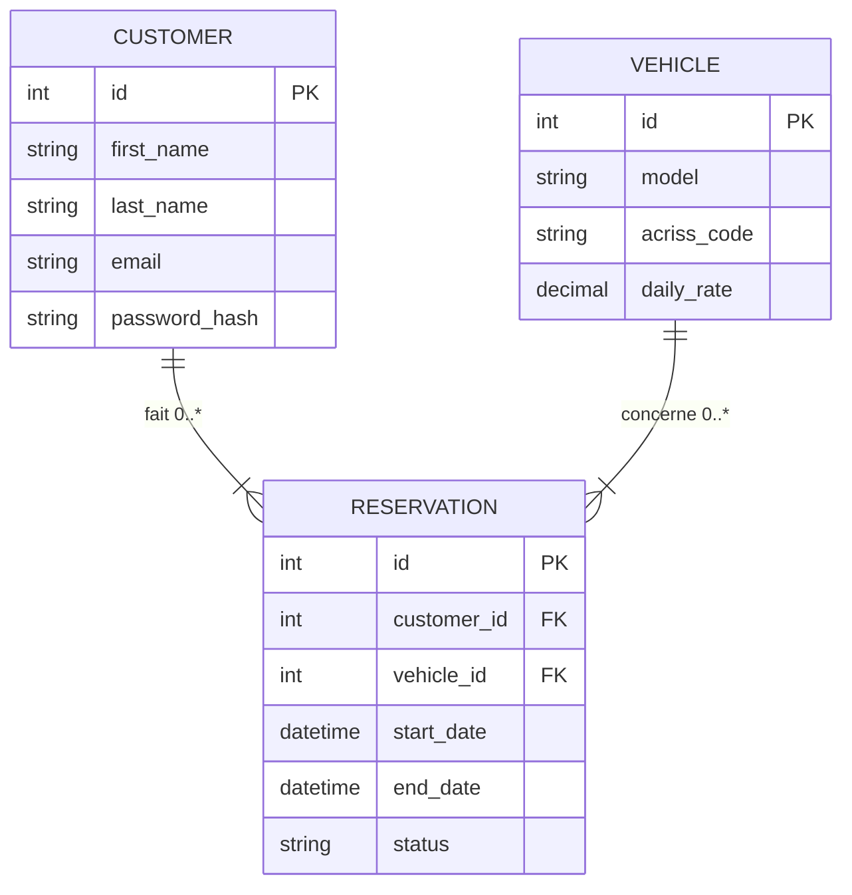
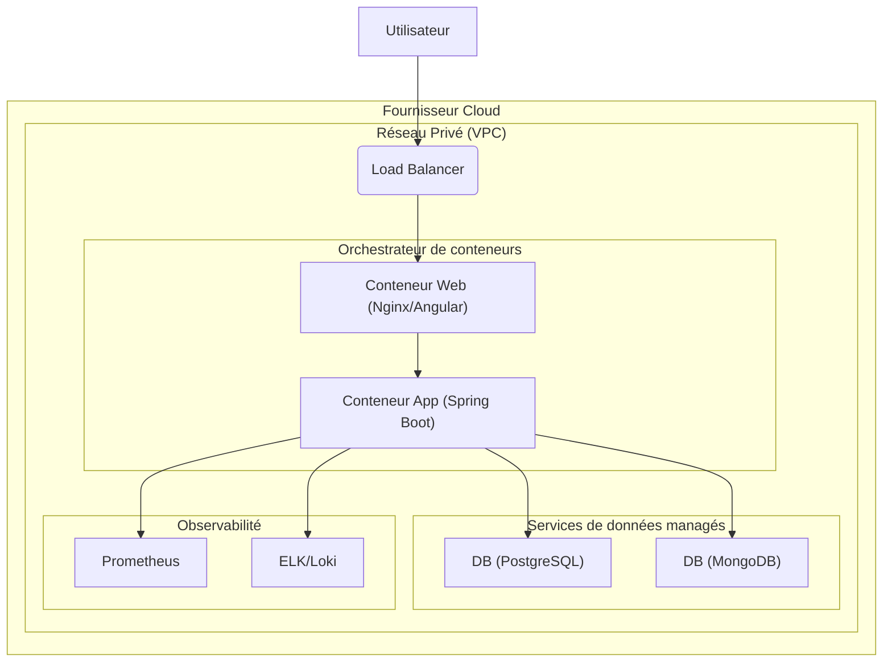
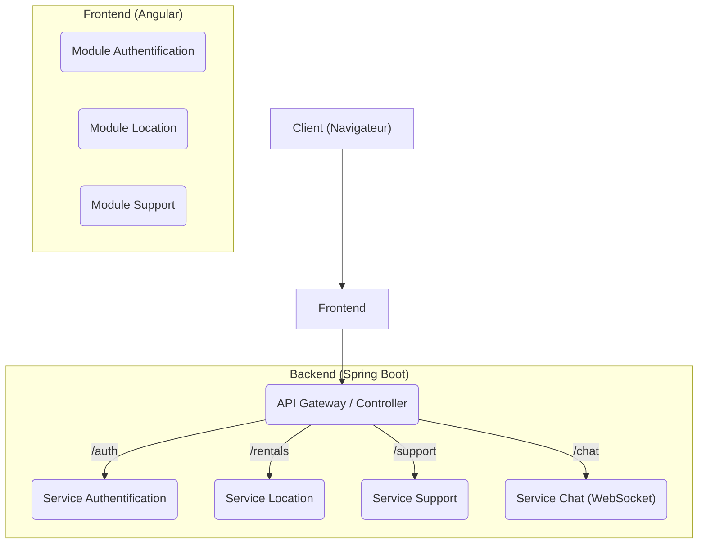

# Architecture Definition Document – Your Car Your Way

## Sommaire
- [Architecture Definition Document – Your Car Your Way](#architecture-definition-document--your-car-your-way)
  - [Sommaire](#sommaire)
  - [Objet du document](#objet-du-document)
  - [Objectifs du projet](#objectifs-du-projet)
  - [Principes d'architecture](#principes-darchitecture)
  - [Architecture existante](#architecture-existante)
  - [Architectures](#architectures)
    - [Vue métier](#vue-métier)
    - [Vue de données](#vue-de-données)
    - [Vue technologique](#vue-technologique)
  - [Justification de l’approche architecturale](#justification-de-lapproche-architecturale)
  - [Architectures de transition](#architectures-de-transition)
  - [Qualité de service et contraintes](#qualité-de-service-et-contraintes)

---

## Objet du document
Ce document décrit l'architecture logicielle et technique de l'application **Your Car Your Way**. Il a pour objectif de fournir une vision claire et unifiée pour guider les équipes de développement, d'exploitation et de maintenance.

---

## Objectifs du projet
- Améliorer l'expérience client: parcours de réservation fluide, suivi et historique accessibles.
- Optimiser le support: gestion des tickets et chat en temps réel pour une meilleure réactivité.
- Faciliter l'intégration: fournir une API aux agences pour opérer sur clients et réservations.
- Assurer l'observabilité: exposition de métriques et centralisation des logs dès la V1.

---

## Principes d'architecture
- **Monolithe modulaire :** Pour la V1, l'application sera un monolithe basé sur Spring Boot. La modularité interne (par fonctionnalité) facilitera la maintenance et une éventuelle migration future vers des microservices.
- **Séparation des responsabilités (SoC) :** Le frontend (Angular) est entièrement découplé du backend (API REST).
- **Hybridation des données :** Utilisation d'une base de données relationnelle (PostgreSQL) pour les données transactionnelles critiques et d'une base NoSQL (MongoDB) pour les données non structurées et temps réel (chat).
- **Sécurité par conception :** Application des principes de l'OWASP Top 10, authentification via JWT, et communication sécurisée (HTTPS).
- **Scalabilité et élasticité :** L'infrastructure sera conteneurisée (Docker) et déployée sur un cloud managé pour s'adapter à la charge.
- **Interopérabilité :** API RESTful documentée (OpenAPI) permettant aux agences de réaliser des opérations CRUD sur clients et réservations, tout en respectant la norme ACRISS pour les véhicules.
- **Observabilité :** Collecte centralisée des logs et exposition de métriques via Prometheus et une stack ELK/Loki.

---

## Architecture existante
Le projet ne s'appuie sur aucun produit existant. Il n’existe donc pas d’architecture actuelle à documenter.

---

## Architectures

### Vue métier
Cette vue décrit les processus métier et les acteurs interagissant avec le système. Elle est détaillée dans le document *Business Requirements*.

**Diagramme de cas d'utilisation**
```mermaid
graph TD
    subgraph "Système Your Car Your Way"
        UC1("Gérer son compte")
        UC2("Louer un véhicule")
        UC3("Traiter les demandes support")
        UC4("Gérer les données (via API)")
    end

    Client --|> UC1 & UC2
    AgentSupport --|> UC3
    Admin --|> UC4
```

### Vue de données
Cette vue décrit la structure et la gestion des données.

**Schéma relationnel simplifié (PostgreSQL)**

**Modèle de document (MongoDB pour le chat)**
```json
{
  "conversation_id": "ObjectId('...')",
  "customer_id": 123,
  "agent_id": 456,
  "messages": [
    { "sender": "customer", "timestamp": "...", "content": "Bonjour..." },
    { "sender": "agent", "timestamp": "...", "content": "Bonjour, comment puis-je vous aider ?" }
  ]
}
```

### Vue technologique
Cette vue décrit l'infrastructure et les technologies utilisées.

**Diagramme de conteneurs (inspiré de C4)**


**Diagramme de composants (simplifié)**


---

## Justification de l’approche architecturale
- Alignement sur les objectifs métier : parcours client fluide, support réactif, intégration agences via API.
- Respect des principes d’architecture : séparation des responsabilités, modularité, sécurité par conception, observabilité et interopérabilité.
- Normes et bonnes pratiques : APIs REST documentées (OpenAPI), OWASP Top 10, gestion des secrets, CI/CD.
- Avantages : simplicité de déploiement (monolithe modulaire), suivi en production (métriques et logs) et évolutivité maîtrisée.

---

## Architectures de transition
Aucune architecture de transition n'est prévue pour la V1. L'architecture monolithique modulaire a été choisie pour répondre aux besoins actuels tout en préparant le terrain pour une future évolution vers des microservices si la complexité du projet venait à augmenter de manière significative.

---

## Qualité de service et contraintes
- **Performance :** Temps de réponse de l'API < 500ms (P95).
- **Disponibilité :** 99.9% (hors maintenance planifiée).
- **Sécurité :** Chiffrement des données sensibles (mots de passe), protection contre les injections SQL/XSS, utilisation de HTTPS.
- **Déploiement :** Intégration et déploiement continus (CI/CD) via GitHub Actions.
- **Monitoring :** Supervision des métriques applicatives (via une solution de type Prometheus) et des logs centralisés (via une solution de type ELK/Loki).
